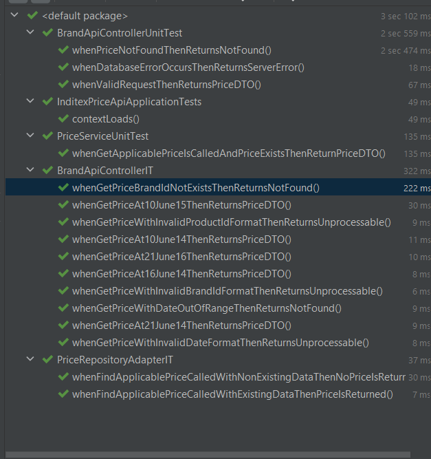

# inditex-price-api
> Capa API para la gestión de precios en Inditex

## Table of Contents
* [General Info](#general-information)
* [Technologies Used](#technologies-used)
* [Features](#features)
* [Setup](#setup)
* [Usage](#usage)
* [Project Status](#project-status)
* [Room for Improvement](#room-for-improvement)
* [Arquitecture](#arquitecture)
* [Screenshots](#screenshots)

## General Information
- La `inditex-price-api` es una API diseñada para gestionar y recuperar información sobre precios de productos para las tiendas Inditex.
- El objetivo principal es proporcionar una manera rápida y eficiente de consultar precios, teniendo en cuenta diferentes criterios como fechas, producto y marca.

## Technologies Used
- Java - versión 17
- Spring Boot - versión 3.1.5
- Caffeine Cache - versión 3.1.8
- JUnit - versión 5.9.3
- Flyway - versión 9.16.3

## Features
Listo para usar características:
- Consulta de precios por fecha, ID de producto y ID de marca.
- Caché eficiente para mejorar el rendimiento de las consultas frecuentes.
- Arquitectura basada en microservicios para facilitar la escalabilidad y el mantenimiento.
- Arquitectura hexagonal.

## Setup
Este proyecto utiliza Maven para la gestión de dependencias. 
Puedes configurar tu entorno local clonando el repositorio y ejecutando `mvn install` para instalar las dependencias necesarias.

## Usage
Para iniciar la aplicación, ejecuta:
```
mvn spring-boot:run
```
Luego, puedes realizar solicitudes a endpoints como:
```
curl -X GET 'http://localhost:8080/v1/brands/1/products/35455/prices?date=2022-12-24T10:00:00'
```

## Project Status
El proyecto está: _completed_

## Arquitecture
#### Capa de Aplicación:
PriceService (PriceService.java): Este servicio implementa PriceServicePort y utiliza PriceRepositoryPort para obtener precios aplicables.
Al depender de abstracciones (puertos), en lugar de implementaciones concretas, se sigue el Principio de Inversión de Dependencias.

##### Puertos:

PriceServicePort (PriceServicePort.java): es una interfaz clave en la capa de aplicación que define las operaciones relacionadas con el servicio de precios.
Como un "puerto de entrada" (in-port), establece un punto de interacción claro y bien definido para las operaciones externas que desean acceder a la lógica de negocio central.

PriceRepositoryPort (PriceRepositoryPort.java): actúa como un "puerto de salida" (out-port) en la arquitectura hexagonal, definiendo una interfaz para la obtención de precios aplicables.
Este puerto establece un contrato entre la capa de aplicación y el dominio, permitiendo que la capa de aplicación interactúe con el dominio (y, por extensión, con la infraestructura de datos) de una manera desacoplada y abstracta.

#### Capa de Infraestructura (Adaptadores):
PriceRepositoryAdapter (PriceRepositoryAdapter.java): Implementa PriceRepositoryPort y extiende JpaRepository,
proporcionando la implementación concreta para la persistencia de datos. 
Este adaptador conecta la lógica de negocio con la base de datos.

BrandApiController (BrandApiController.java): Este controlador maneja las solicitudes HTTP y utiliza PriceService. 
Representa un adaptador de entrada, conectando la aplicación con el mundo exterior.

#### Modelo de Dominio:
Price (Price.java): Define la entidad Price con sus atributos y relaciones. 
Este modelo es parte de la capa de dominio y contiene lógica de negocio relevante,
manteniéndose desacoplado de detalles como la interfaz de usuario o la infraestructura de datos.

### Decisiones de Diseño y Herramientas Utilizadas:
ControllerAdvice:
Permite manejar de manera centralizada las excepciones de toda la aplicación. 
Facilita la implementación de un manejo de errores consistente y reduce la duplicación de código de manejo de errores.

Jacoco:
Es una herramienta de informes de cobertura de código que se utiliza para medir qué tan bien están cubiertos los códigos fuente por las pruebas. 
La decisión de utilizar Jacoco fue para garantizar que se mantenga un alto estándar de calidad del código y que las funcionalidades críticas estén debidamente probadas.

## Room for Improvement

Áreas de mejora:
- Expansión de la API para manejar más tipos de consultas relacionadas con precios.
- Load Balancing.
- Añadir monitoring
- Reactivo
- Pruebas de rendimiento ej: Gatling

## Screenshots
